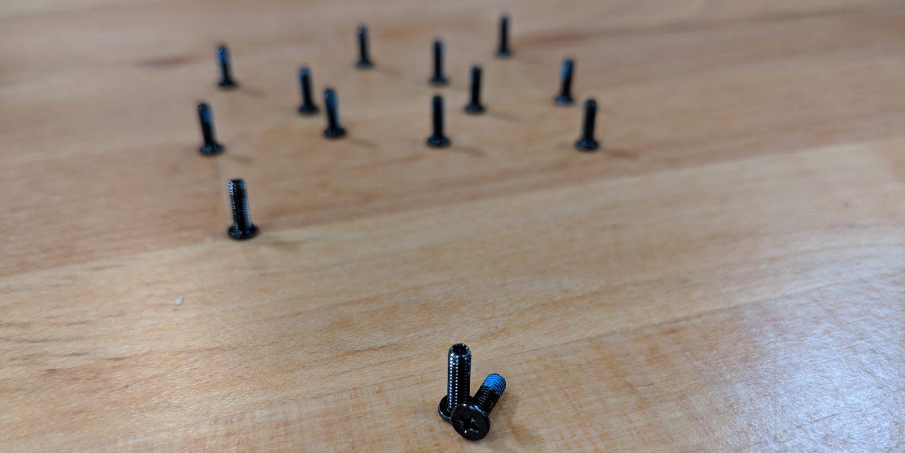

# Adder WS (External Overview)

## Left side overview:

## Right side overview:

## Front side overview:

## Back side overview:

## Bottom case screw sizes

The Adder WS uses a single size of screw for securing the bottom case, battery, and keyboard.

## Front LED lights

|Icon                                |Color          |Description                                      |
|------------------------------------|---------------|-------------------------------------------------|
|       |Orange         |DC power plugged in                              |
|                                    |Green          |Computer is on                                   |
|                                    |Blinking green |Computer is sleeping                             |
|   |Orange         |Battery charging                                 |
|                                    |Green          |Battery fully charged                            |
|                                    |Blinking orange|Battery critically low                           |
| |Green          |Airplane mode is on (WiFi/Bluetooth disabled)|
|   |Green          |Storage drive activity                           |
|  |Green          |Num Lock enabled                                 |
||Green          |Caps Lock enabled                                |
||Green          |Scroll Lock enabled                              |
|           |Off            |GPU in MSHYBRD Mode                              |
|                                    |Green          |GPU in Discrete Mode                             |
## Keyboard Shortcuts

The Adder WS has the following actions available using the Fn and Function keys:

|Key                   |Shortcut|Action                             |
|----------------------|--------|-----------------------------------|
| |Fn+F1   |Toggle trackpad                    |
| |Fn+F2   |Lock screen and toggle built-in LCD|
| |Fn+F3   |Mute                               |
||Fn+*    |Toggle keyboard backlight          |
| |Fn+F5   |Volume down                        |
| |Fn+F6   |Volume up                          |

