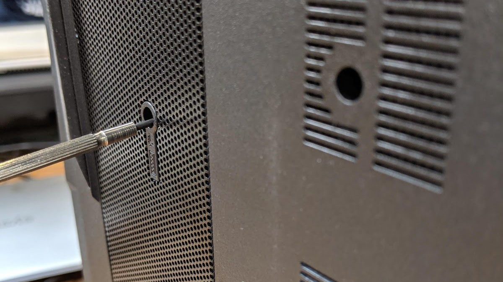

# Adder WS (Parts & Repairs)

Many components on your Adder WS can be upgraded or replaced as necessary. Follow these step-by-step guides for instructions:

- [Replacing the keyboard](#replacing-the-keyboard)
- [Removing the bottom cover](#removing-the-bottom-cover)
- [Replacing the RAM](#replacing-the-ram)
- [Replacing an M.2/NVMe SSD](#replacing-an-m2nvme-ssd)
- [Replacing the fans/heatsink/thermal paste](#replacing-the-cooling-system)
- [Replacing the CMOS battery](#replacing-the-cmos-battery)
- [Replacing the external battery](#replacing-the-external-battery)
- [Replacing the WiFi/Bluetooth module](#replacing-the-wireless-card)

## Replacing the keyboard:

Keyboard replacement is simple and requires only a cross-head screwdriver.

**Tools required:** Cross-head (Phillips) screwdriver    
**Time estimate:** 10 minutes    
**Difficulty:** Easy ●    
**Screws:** 2 total - 2 x M2 (black)

### Steps to replace the keyboard:

1. Place the Adder WS lid-side-down.
2. Remove the 2 keyboard screws, indicated by the small keyboard icons.

3. Open the Adder WS and place it on its side.
4. Push the screwdriver into the keyboard push point until the keyboard pops out.

5. Set the Adder WS down, then starting from the top side, pull the keyboard loose.

6. Flip the keyboard over onto the trackpad.

7. Pull the large ribbon cable out of the connector.
8. The small ribbon cables have latches. Gently pull the latches from both sides
and remove the ribbon cables.
9. Remove the keyboard and replace it with the new one.
10. Insert the large ribbon cable into the connector.
11. Seat the small ribbon cables, then apply pressure equally to both sides of the
connector to secure.
12. Flip the keyboard over and press the bottom tabs of the keyboard into the case.
13. Secure the keyboard by pressing down on the edges of the keyboard.
14. Flip the Adder WS over.
15. Replace the 2 screws holding the keyboard in place.
16. Boot your Adder WS and confirm the keyboard is operational.

## Removing the bottom cover:

Removing the cover is required to access the internal components. Prior to removing the cover, ensure the AC power is unplugged and all peripherals (including SD cards and USB drives) are unplugged or removed from the system.

**Tools required:** Cross-head (Phillips) screwdriver    
**Time estimate:** 10 minutes    
**Difficulty:** Medium ●    
**Screws:** 14 total - 12 x M2 perimeter (black); 2 x M2 keyboard (black)

### Steps to remove the bottom cover:

1. Place the Adder WS lid-side down.
2. Remove the external battery.
3. [Remove the keyboard.](#replacing-the-keyboard)
4. Remove the two screws underneath the keyboard labeled ‘M2’.

5. Remove the 12 perimeter screws.

6. The bottom cover will lift off, starting from the front corners working to the back
near the hinges.

### Steps to replace the bottom cover:

1. Align the bottom cover to the case towards the back and hinges.
2. Set the bottom cover along the edges and confirm the bottom cover is seated.
3. Replace the 12 perimeter screws.
4. Replace the 2 keyboard screws.

## Replacing the RAM:

RAM acts as temporary storage for your computer. More RAM generally provides better performance. If you're purchased new RAM, need to replace your RAM, or are reseating your RAM, follow these steps.

**Tools required:** Cross-head (Phillips) screwdriver    
**Time estimate:** 15 minutes    
**Difficulty:** Medium ● 

### Steps to replace the RAM:

1. Follow the steps above to [remove the bottom cover](#removing-the-bottom-cover).
2. Press the small tabs on both sides of the RAM simultaneously. The RAM should spring up to an angle.

3. Remove the RAM from the slot.
4. Insert the new RAM (or reseat the existing RAM) by placing it in the keyed slot and pressing down on the RAM until it clicks into place.

## Replacing an M.2/NVMe SSD:

M.2 SSDs offer, at minimum, SATA III speeds and performance in a package about the size of a stick of gum. NVMe M.2 SSDs offer even higher performance. The Adder WS supports two M.2 SSDs, size 2280, either M.2 SATA or NVMe M.2 PCIe Generation 3.

**Tools required:** Cross-head (Phillips) screwdriver    
**Time estimate:** 5 minutes    
**Difficulty:** Medium ● 

### Steps to replace the M.2 drive:

1. Follow the steps above to [remove the bottom cover](#removing-the-bottom-cover).
2. Locate the M.2 drive (or slot.)

3. Unscrew the retainer screw opposite the M.2 slot.
4. Remove the existing M.2 drive by pulling it out of the slot.
5. Insert the new M.2 drive into the slot and hold it in place.
6. Replace the retainer screw.

## Replacing the cooling system:

If the CPU fan becomes noisy and cleaning it out doesn't fix the issue, you may need a new CPU fan. Contact Support to start a warranty claim or parts purchase.

In rare cases, or after several years, it may be necessary to apply new thermal paste between the CPU and the heatsink. Thermal paste helps facilitate effective heat transfer between the CPU and the cooling equipment. These instructions can also be used in the unlikely event your heatsink needs replacing.

**Tools required:** Cross-head (Phillips) screwdriver    
**Time estimate:** 5 minutes    
**Difficulty:** High ● 

### Steps to replace the fans/heatsink/thermal paste:

1. Follow the steps above to [remove the bottom cover](#removing-the-bottom-cover).
2. Locate the CPU heatsink screws.

3. Remove the screws, starting with #10, then #9, and continue until you have removed #1.
4. Carefully remove the heatsink/fans from the case.
5. Using a paper towel, remove the existing thermal paste. You may also use a small amount of rubbing alcohol to remove excess or difficult-to-remove paste.
6. After cleaning the CPU, GPU, and heatsink, apply a small line of thermal paste directly onto the CPU and GPU core.
7. Carefully replace the heatsink.
8. Replace the screws, starting with #1, then #2, and so on until #10. Do not fully tighten until sets #1-#3 and #4-#6 are in place, then fully tighten all screws for each set (#1-#3 and #4-#6).

## Replacing the CMOS battery:

The CMOS battery supplies power to the Adder WS's CMOS chip. Changes you make to the BIOS and the comptuer's hardware clock are stored on the CMOS. If your Adder WS doesn't boot, you can reset the CMOS to force a low-level hardware reset. If your clock is constantly resetting, it's likely your CMOS battery needs replacing.

**Tools required:** Cross-head (Phillips) screwdriver    
**Time estimate:** 5 minutes    
**Difficulty:** Medium ● 

### Steps to replace the CMOS battery:

1. Follow the steps above to [remove the keyboard](#replacing-the-keyboard).
2. Locate the CMOS battery. Use a thin plastic tool to remove the CMOS battery.
3. Power up the Adder WS. The system may power itself off and on after initial boot; this is normal behavior.
4. Press F2 to enter the BIOS.
5. Choose the "Setup Utility".
6. Press F9 to Load Setup Defaults.
7. Click on "Advanced" in the left menu.
8. Choose "Advanced Chipset Control".
9. Choose "ME State" and set this option to "Disabled".
10. Press F10 to save and resume normal boot.

## Replacing the external battery

The battery provides primary power whenever the system is unplugged.

**Tools required:** Cross-head (Phillips) screwdriver    
**Time estimate:** 5 minutes    
**Difficulty:** Easy ●

### Steps to replace the external battery

1. Remove the two screws that hold the battery and then remove the battery.
2. Place the new battery in and then add the two screws back.

## Replacing the wireless card

Your Adder WS's WiFi and Bluetooth are both handled by the same module. It is a standard M.2 2230 slot with PCIe and USB interfaces (A Key).

**Tools required:** Cross-head (Phillips) screwdriver    
**Time estimate:** 5 minutes    
**Difficulty:** Medium ● 

### Steps to replace the WiFi/Bluetooth module

1. Follow the steps above to [remove the bottom cover](#removing-the-bottom-cover).
2. Locate the wireless card.
3. Gently remove the two antennas by pulling them up and away from the wireless card.
4. Remove the retaining screw opposite the M.2 slot.
5. Remove the wireless card from the M.2 slot.
6. Insert the new wireless card into the M.2 slot.
7. Replace the retaining screw.
8. Attach the two antennas by aligning the circular fitting and pressing onto the wireless card. The connector will snap into place. _Use caution when attaching the connectors; the pins can bend, break, or snap._
