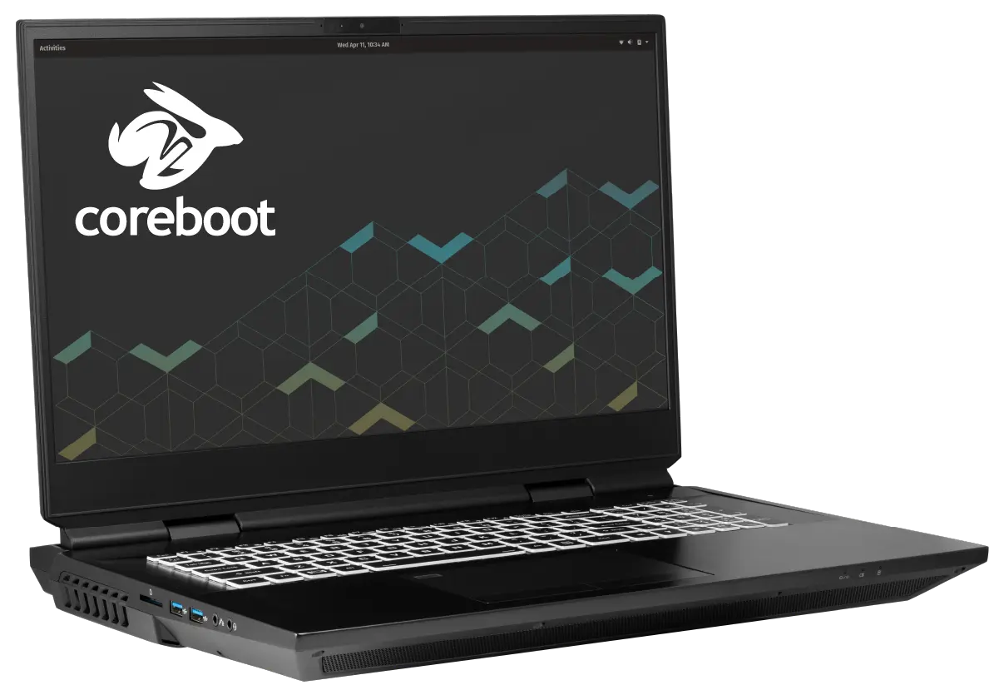

# Bonobo WS (bonw14)

- [External Overview](./external-overview.md)
- [Internal Overview](./internal-overview.md)
- [Parts & Repairs](./repairs.md)

The System76 Bonobo WS is a laptop with the following specifications:

- CPU
    - Supports Intel 10th Generation (Comet Lake) Desktop CPUs
        - [Core i5-10600K](https://ark.intel.com/content/www/us/en/ark/products/199311/intel-core-i5-10600k-processor-12m-cache-up-to-4-80-ghz.html)
        - [Core i7-10700K](https://ark.intel.com/content/www/us/en/ark/products/199335/intel-core-i7-10700k-processor-16m-cache-up-to-5-10-ghz.html)
        - [Core i9-10900K](https://ark.intel.com/content/www/us/en/ark/products/199332/intel-core-i9-10900k-processor-20m-cache-up-to-5-30-ghz.html)
- Chipset
    - [Intel Z490 Express](https://ark.intel.com/content/www/us/en/ark/products/201834/intel-z490-chipset.html)
- Firmware
    - [System76 Open Firmware](https://github.com/system76/firmware-open)
- EC
    - ITE IT5570E running [System76 EC](https://github.com/system76/ec)
- GPU
    - NVIDIA GeForce RTX 2080 Super
        - or NVIDIA GeForce RTX 2070 Super
        - or NVIDIA GeForce RTX 2060
    - eDP 17.3" 1920x1080@144Hz LCD
        - or eDP 17.3" 3840x2160@60Hz LCD
    - HDMI, 2 x Mini DisplayPort 1.4, and 2 x DisplayPort 1.4 over USB-C
- Memory
    - Up to 128GB (4x32GB) quad-channel DDR4 SO-DIMMs @ 3200 MHz
- Networking
    - Gigabit Ethernet
    - M.2 PCIe/CNVi WiFi/Bluetooth
        - Intel Wi-Fi 6 AX200/AX201
- Power
    - 2 x 280W (20V, 14A) AC adapter
    - 97Wh 8-cell Lithium-Ion battery
- Sound
    - Internal speakers (stereo + subwoofer) & microphone
    - Combined headphone & microphone 3.5mm jack
    - Combined microphone & S/PDIF (optical) 3.5mm jack
    - HDMI, Mini DisplayPort, USB-C DisplayPort audio
- Storage
    - 4x M.2
        - 2x PCIe NVMe or SATA
        - 1x PCIe only
        - 1x SATA only
    - SD card reader
- USB
    - 3x USB 3.2 Gen 2 Type-A
    - 1x USB Type-C with Thunderbolt 3
    - 1x USB 3.2 Gen 2 Type-C with DisplayPort 1.4
    - 1x USB 3.2 Gen 2x2 Type-C
- Dimensions
    - 4.343cm x 39.903cm x 31.902cm, 3.80kg
