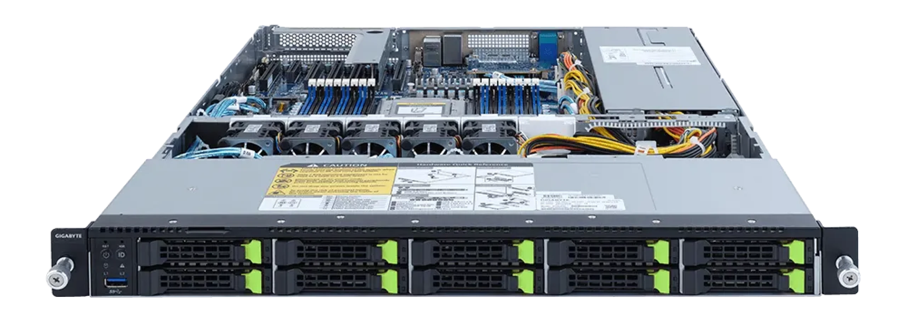

# Eland 1U (elan1-r2)

The System76 Eland 1U is a rack-mount server with the following specifications:

- CPU options
  - Supports AMD EPYC™ 7003 series processor family
  - Single processor
- Memory
  - Up to 4096GB (16x256GB) ECC DDR4 @ 3200 MHz
- Storage
  - 10 x 2.5" Gen4 U.2 hot-swappable HDD/SSD bays  
- Networking
  - 2x 1GbE LAN ports ([1 x Intel® I350-AM2](https://ark.intel.com/content/www/us/en/ark/products/52968/intel-ethernet-controller-i350am2.html))
  - 1x 10/100/1000 management LAN
- Expansion
  - 1x PCIe 4.0 x16
- Front Overview:
  - 1 x USB 3.0
  - 1 x Power button with LED
  - 1 x ID button with LED
  - 1 x NMI button
  - 1 x Reset button
  - 2 x LAN activity LEDs
  - 1 x HDD activity LED
  - 1 x System status LED
- Back Overview:
  - 3 x USB 3.0
  - 1 x VGA
  - 1 x COM
  - 2 x RJ45
  - 1 x [MLAN](./elan1-r2_manual.pdf#page=128)
  - 1 x ID button with LED
- Power Supply
  - 2 x 1100W redundant power supply, 80 PLUS Platinum
  - AC Input: 100-240Vac/ 12-6A, 50-60Hz
- Dimensions
  - 43.8cm × 66.0cm × 43.5cm
- Weight
  - 20.32 kg
- Model
  - elan1-r2 - [Gigabyte R152-Z33](./elan1-r2_manual.pdf)
