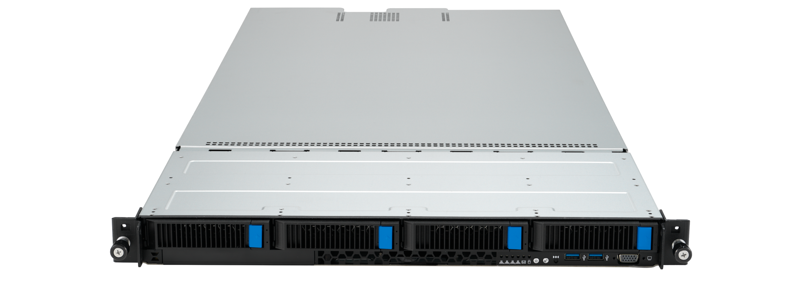
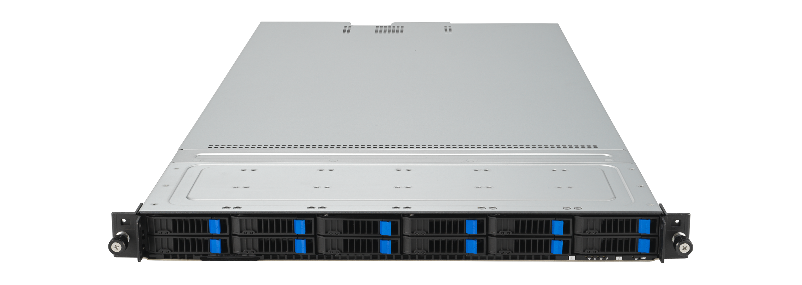

# Eland 1U (elan1-r3)

The System76 Eland 1U is a rack-mount server with the following specifications:

- CPU options
  - Supports AMD EPYC™ 9004 series processor family
  - Single processor
- Memory
  - Up to 1,536GB DDR5 4800 RDIMM (24 DIMM slots)
- Storage
  - 2 x PCIe Gen4 M.2
  - Option 1
    - 4 x 3.5" HDD/SSD/NVMe Hot Swap Storage Bays
  - Option 2
    - 12 x 2.5" SSD/NVMe Hot Swap Storage Bays
- Networking
  - 2x 1GbE LAN ports ([1 x Intel® I350-AM2](https://ark.intel.com/content/www/us/en/ark/products/52968/intel-ethernet-controller-i350am2.html))
  - 1x 10/100/1000 management LAN
- Expansion
  - 1 x PCIe x16 slot (Gen5 x16 link, FH, HL)
  - 1 x PCIe x16 slot (Gen5 x16 link, LP, HL)
  - 1 x PCIe x16 slot (Gen5 x8 link, LP, HL)
  - 1 x OCP3.0 socket (Gen5 x16 link) 
- Front Overview:
  - 2 x USB 3.2 Gen1
  - 1 x VGA port
  - 1 x Power Button/LED
  - 1 x Location Button/LED
  - 1 x Message LED
  - 1 x HDD LED
  - 4 x LAN LEDs
    - 1-2 on-board LAN
    - 3-4 OCP LAN
- Back Overview:
  - 2 x USB 3.2 Gen1
  - 1 x VGA port
  - 1 x Management port
  - 1 x Port80 LED (Q-Code)
  - 1 x Power Button/LED
  - 1 x Location Button/LED
  - 1 x Message LED
- Power Supply
  - 2 x Redundant 1600W Power Supply
  - AC Input: 100-240Vac/ 12-7A, 50-60Hz
- Dimensions
  - 84.25cm × 44.9cm × 4.39cm
- Weight
  - 14.16 kg
- Model
  - elan1-r3
