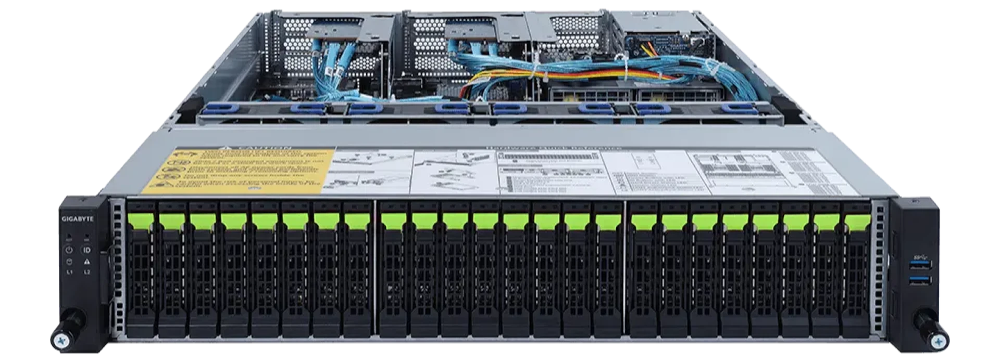

# Eland Pro 2U (elap2-r3)

The System76 Eland Pro 2U is a rack-mount server with the following specifications:

- CPU options
  - Supports AMD EPYC™ 7003 series processor family
  - Compatible with AMD EPYC™ 7002 series processor family
  - Dual processors
- Memory
  - Up to 8192GB (32x256GB) ECC DDR4 @ 3200 MHz
- Storage
  - Front:
    - 24 x 2.5" Gen4 U.2 hot-swappable HDD/SSD bays
  - Rear:
    - 2 x 2.5" SATA/SAS hot-swappable HDD/SSD bays
    - 1 x PCIe Gen4 M.2 slot for OS installation
  - Note: CPU TDP is limited to 225w if using M.2 device
- Networking
  - 2x 1GbE LAN ports ([1 x Intel® I350-AM2](https://ark.intel.com/content/www/us/en/ark/products/52968/intel-ethernet-controller-i350am2.html))
  - 1x 10/100/1000 management LAN
- Expansion
  - Riser Card CRS2014:
    - 1 x PCIe 4.0 x16
  - Riser Card CRS2033:
    - 1 x PCIe 4.0 x16
    - 1 x PCIe 4.0 x8
    - 1 x PCIe 4.0 x8
  - Riser Card CRS2033:
    - 1 x PCIe 4.0 x16
    - 1 x PCIe 4.0 x8
    - 1 x PCIe 4.0 x8
- Front Overview:
  - 2 x USB 3.0
  - 1 x Power button with LED
  - 1 x ID button with LED
  - 1 x Reset button
  - 1 x NMI button
  - 1 x System status LED
  - 1 x HDD activity LED
  - 2 x LAN activity LEDs
- Back Overview:
  - 2 x USB 3.0
  - 1 x VGA
  - 2 x RJ45
  - 1 x [MLAN](./elap2-r3_manual.pdf#page=115)
  - 1 x ID button with LED
- Power Supply
  - 2 x 1600W redundant PSUs, 80 PLUS Platinum
  - AC Input: 100-240Vac/ 12-10A, 50-60Hz
- Dimensions
  - 43.8cm × 73.0cm × 8.7cm
- Weight
  - 25.5 kg
- Model
  - elap2-r3 - [Gigabyte R282-Z94](./elap2-r3_manual.pdf)
