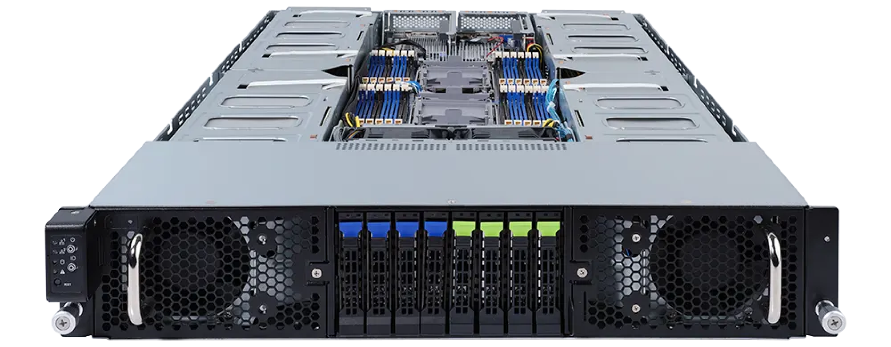

# Ibex Pro 2U (ibep2-b1)

The System76 Ibex Pro 2U is a rack-mount server with the following specifications:

- CPU options
  - Supports 3rd Gen Intel® Xeon® Scalable processors
  - Dual processors
- Memory
  - Up to 6144GB (24x256GB) ECC DDR4 @ 3200 MHz
- Storage
  - Front:
    - 8 x 2.5" hot-swappable HDD/SSD bays
    - 4 x blue HDD trays compatible with SATA/SAS devices only
    - 4 x green HDD trays compatible with SATA/SAS/Gen4 NVMe devices
- Networking
  - 2 x 10Gb/s BASE-T LAN ports ([Intel® X710-AT2](https://www.intel.com/content/www/us/en/products/sku/189534/intel-ethernet-controller-x710at2/specifications.html))
  - 1x 10/100/1000 management LAN
- Expansion
  - 8 x PCIe x16 slots (Gen4 x16 bus) for GPUs
  - 2 x PCIe x16 (Gen4 x16 bus) Half-length low-profile slot
- Front Overview:
  - 1 x Power button with LED
  - 1 x ID button with LED
  - 1 x Reset button
  - 1 x System status LED
  - 1 x HDD activity LED
  - 2 x LAN activity LEDs
- Back Overview:
  - 2 x USB 3.0
  - 1 x VGA
  - 2 x RJ45
  - 1 x [MLAN](./ibep2-b1_manual.pdf#page=104)
  - 1 x Power button with LED
  - 1 x ID button with LED
  - 1 x Reset button
  - 1 x NMI button
  - 1 x System status LED
- Power Supply
  - 2 x 1200W redundant PSUs, 80 PLUS Platinum
  - AC Input: 100-240Vac/ 14-12A, 50-60Hz
- Dimensions
  - 16.3” x 31.4” x 3.4” (448 x 800 x 87.5 mm)
- Weight
  - 79.3 lbs (36 kg)
- Model
  - ibep2-b1 - [Gigabyte G292-280](./ibep2-b1_manual.pdf)
