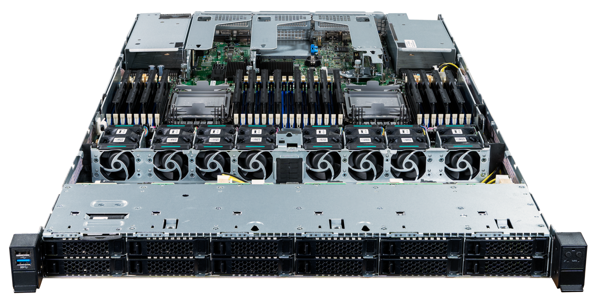

# Jackal Pro 1U (jacp1-b2)

The System76 Jackal Pro 1U is a rack-mount server with the following specifications:

- CPU options
  - Supports 3rd Gen Intel® Xeon® Scalable processors
  - Dual processors
- Memory
  - Up to 8192GB (32x256GB) ECC DDR4 @ 3200 MHz
- Storage
  - Front:
    - 12 x 2.5" SATA/SAS hot-swappable HDD/SSD bays
  - Internal:
    - 2x PCIe Gen3 M.2 slots
- Networking
  - 2x 1GbE LAN ports
- Expansion
  - Riser Card 1: 1x PCIe x16
  - Riser Card 2: 1x PCIe x16 or 1 x PCIe x16 and PCIe x8 NVMe Riser Card
  - Riser slot 3: 2x PCIe x8 two slot NVMe Riser Card
- Front overview
  - 1x USB 3.0
  - 1x USB 2.0
  - 1x Power button with LED
  - 1x ID button with LED
  - 1x Cold reset button (tool required)
  - 1x NMI button (tool required)
  - 1x System status LED
  - 1x Drive activity LED
- Back overview
  - 3x USB 3.0
  - 1x VGA
  - 2x RJ45
  - 1x RJ45 Remote management port
  - 1x RJ45 Serial port
- Power supply
  - 1300 Watt High Efficiency w/optional Dual Redundancy
- Dimensions
  - 78.1cm x 43.8cm x 4.3cm
- Weight
  - 17.24 kg
- Model
  - jacp1-b1 - [Intel M50CYP1UR](./jacp1-b2_manual.pdf)
