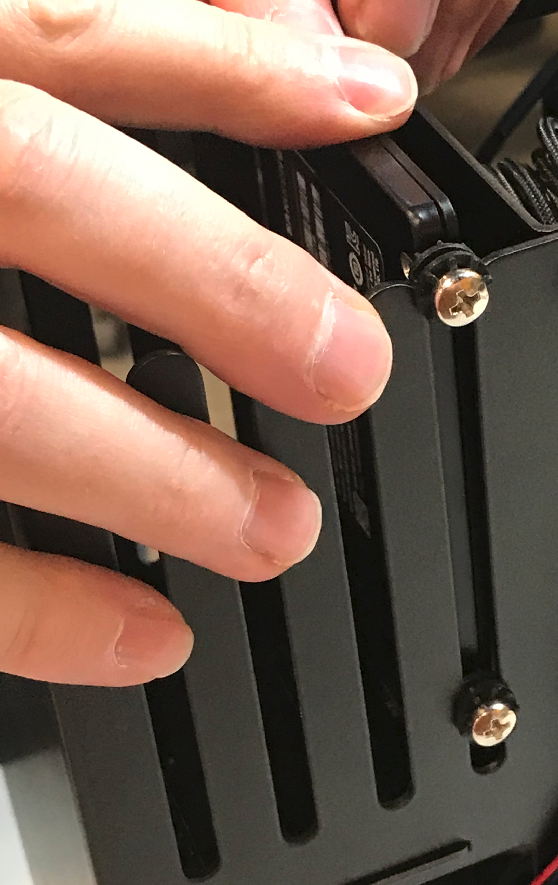

# Contents
## Thelio Major B2 BIOS Overview
### BIOS
- M.I.T.
- System
- BIOS
- Peripherals
- Chipset
- Power
- Save & Exit

## User Serviceable Parts and Repairs
### Top Case (Remove or Replace)
- Removing the Top Case
- Replacing the Top Case
### Shroud (Remove or Replace)
- Removing the Shroud
- Replacing the Shroud
### RAM (Remove or Replace)
- Removing the RAM
- Replacing the RAM
### Drives (Remove or Replace)
- Replacing a 2.5" Drive
- Replacing an M.2/NVMe Drive
### GPUs (Remove or Replace)
### CPU Thermal Paste (Remove or Replace)
### Specifications

# BIOS

## Hardware Keyboard Shortcuts:

F12 : Boot Menu

F9  : System Information

ESC : BIOS

END : Q-Flash

## M.I.T

**Fig. 1:** The M.I.T. page allows tweaking the frequency of some system components.

## System

**Fig. 2:** System summary in BIOS.

## BIOS

**Fig. 3:** BIOS boot summary.

## Peripherals

**Fig. 4:** BIOS section for Peripheral setup.

## Chipset

**Fig. 5:** Chipset information in Thelio BIOS.

## Power

Fig. 6: Power Management settings.

## Save & Exit

Fig. 7: Exit the BIOS saving changes to settings.

# Top Case (Remove or replace)

## Removing the Top Case
Before servicing your Thelio, be sure to power off and unplug all cords from the computer.

Top Case removal is simple and requires, at most, a cross-head (Phillips) screwdriver.

You can find video instructions on this process [here.](https://youtu.be/Ku91wRHFGY8)

Link for the video for Top Case Service:
(https://youtu.be/Ku91wRHFGY8)

Tools required: Fingers or Cross-head (Phillips) screwdriver

Time estimate: 2 minutes

Difficulty: Easy

Screws: 8 total
  - 8 Thumbscrews (Phillips/Crosshead).

**Fig. 9:** Thelio Outer Case views, front (left), back (middle), Top Case partial removal (right).

<!--locations of photos and/or description may change.-->

Removing the lid will give you easy access to all components inside.
To remove the lid, you’ll need to unscrew the eight (8) thumbscrews from the back of the Thelio.
These thumbscrews will be on the top left and right, middle left and right, and bottom left and right of the back of the case.

Do not unscrew any screws in the center of the panel here, as those screws correspond with parts inside; removing them will not assist you in removing the lid.
All of Thelio’s thumbscrews are the same size, so don’t worry about mixing them up.
And while a screwdriver is recommended for this procedure, it is not required.
Once you have removed all eight (8) thumb-screws from the back of the lid, lift the lid up and off of the chassis.
Now you can proceed with servicing your machine.
<!--WARNING this is actually an R1-->

**Fig. 10:** Thelio internals with Top Case completely removed.

## Replacing the Top Case
Top Case replacement is simple and requires, at most, a cross-head (Phillips) screwdriver.

**Tools required**: Fingers or Cross-head (Phillips) screwdriver

**Time estimate**: 2 minutes

**Difficulty:** Easy

**Screws:** 8 total
 - 8 Thumbscrews (Phillips/Crosshead).

This guide explains how to easily replace the Thelio’s Top Case after performing maintenance.

1. Align the grooves inside the case with the front of the Thelio frame (the side where the power-button is located).
2. Once aligned, the case should easily slide down over the chassis.
3. Press down on the Top Case to make sure it is firmly seated, and the power button is connected internally.
4. To ensure the case is seated correctly, plug the Thelio back into power, turn on the power-supply switch and examine the front of the unit: the power button LED should light up if you press it, and the system fans should spin to life.

**Fig. 11:** Aligning the Thelio Top Case for replacing (left, top and bottom). Detailed view of Thelio internal switch (right, top and bottom).

<!--locations of photos and/or description may change.-->

# Shroud (Remove or replace)

## Removing the Shroud
CPU Cooler Shroud removal is simple and requires, at most, a cross-head (Phillips) screwdriver.

**Tools required:** Fingers or Cross-head (Phillips) screwdriver

**Time estimate:** 2 minutes

**Difficulty:** Easy

**Screws:** 12 total
  - 12 Thumbscrews (Phillips/Crosshead).

  
  

**Fig. 18:** Removing CPU Cooler Shroud thumbscrews (left). Internal view of the CPU Cooler Shroud (right).

<!-- location of pictures on the page may change -->

<!--Hyperlink to Removing Top Case section needed.-->
<!--This section especially needs checked for accuracy.-->
1. Follow the steps in Removing the Top Case
2. Next unfasten the Shroud. To do this, unscrew the 4 thumbscrews near the top of your chassis. They frame the planet themed air-vent (see fig 18 above).
3. Slide the Cooler Shroud horizontally off of the CPU Cooling fan, and set aside.
4. You are now free to perform work on the CPU Cooler fan, or access other components that may have been obstructed by the shroud.

## Replacing the Shroud

CPU Cooler Shroud replacement is simple and requires, at most, a cross-head (Phillips) screwdriver.

**Tools required:** Fingers or Cross-head (Phillips) screwdriver

**Time estimate:** 2 minutes

**Difficulty:** Easy

**Screws:** 12 total
  - 12 Thumbscrews (Phillips/Crosshead).

  
  

**Fig. 19:** CPU Cooler with Shroud removed side view and top view.

<!-- location of pictures on the page may change -->

  

**Fig. 20:** Replacing the CPU Cooler Shroud and thumbscrews.

1. Slide the Cooler Shroud horizontally over the CPU cooling fan, encasing it.
2. Align the holes of the Shroud with the holes framing the air-vent on the back of the chassis.
3. Replace the four thumbscrews on the back of the case, fastening the shroud to the outer frame.
4. Follow the steps in Replacing the Top Case.

<!--Hyperlink to Replacing Top Case section needed.-->

# RAM (Remove or Replace)

## Removing RAM Sticks

RAM stick removal is simple and requires only removing the Top Case and releasing internal clips. A cross-head (Phillips) screwdriver may be helpful.

You can find video instructions on this process [here.](https://youtu.be/OFv8ByuDGU0)

Link for the video for RAM Service:
(https://youtu.be/OFv8ByuDGU0)

**Tools required:** Fingers or Cross-head (Phillips) screwdriver (for Top Case)

**Time estimate:** 5 minutes

**Difficulty:** Easy

**Screws:** 12 total
  - 12 Thumbscrews (Phillips/Crosshead).

  

  

  

**Fig. 21:** Accessing the RAM release clips (top). Placement of the RAM notch on the motherboard (middle) and on the RAM stick (bottom)

<!-- location of pictures on the page may change -->

1. Follow the steps in Removing the Top Case.
2. It may be helpful, but is not necessary, to Remove the CPU Cooler Shroud.
<!--it may be necessary on this model.-->
3. Press simultaneously on each clip on either side of the RAM stick (fig 21 above). These clips will release the RAM stick and lever it out of it’s slot on the board.
4. Gently, but firmly pull the RAM straight out of the slot, and set aside.

<!--Hyperlink to Removing Top Case section needed.-->
<!--Hyperlink to Removing The Cooler Shroud section needed.-->

## Replacing RAM Sticks

RAM stick replacement is simple and requires only access to the RAM slots on the board, and replacing the Top Case. A cross-head (Phillips) screwdriver may be helpful.

**Tools required:** Fingers or Cross-head (Phillips) screwdriver (for Top Case)

**Time estimate:** 5 minutes

**Difficulty:** Easy

**Screws:** 12 total
  - 12 Thumbscrews (Phillips/Crosshead).

  

  

  

  **Fig. 22:** Indicating the RAM notch on the motherboard (top), and on the RAM stick (middle). Pressing the RAM stick down into place (bottom).

1. Line up the notch on the stick with the notch in the slot. One side of the RAM stick has fewer pins and is shorter. This will help you orient the stick.
2. Insert the RAM stick in the slot. The order of the slots matters, and there must be a RAM stick in the <!--is this slot the same in Major?--> left slot for the machine to boot.
3. Press evenly on the memory stick until both tabs lock into place. You’ll hear two clicks once it’s seated, and the clips will snap closed against the RAM.
4. Once the RAM is in place, replace the CPU Cooler Shroud (if applicable).
5. Replace the Top Case. <!--Hyperlink to Replacing the Top Case section needed here-->
6. Reconnect external devices: keyboard, mouse, monitor(s).
7. Reconnect external power cable and turn power-supply switch to the on position.
8. Power the Thelio on to ensure the RAM is working correctly. If so, the computer will boot normally.

# GPU (Remove or replace)

## Removing the GPU

GPU Removal is a multi-step process, but it is not complicated. A cross-head (Phillips) screwdriver may be helpful, as well as a wooden or plastic (non-conductive) tool for reaching between components. A pencil, ruler, chopsticks or a plastic computer repair tool will work well. **Do not use anything made of metal.**

**Tools required:** Fingers or Cross-head (Phillips) screwdriver, a tool for pressing the GPU release bracket (non-conductive).

**Time estimate:** 10 minutes.

**Difficulty:** Medium

**Screws:** 19 total
  - 19 Thumbscrews (Phillips/Crosshead).

In this guide, you will learn how to remove the graphics card on your Thelio. These steps must be taken in order to replace the GPU.
You can find video instructions on this process [here.](https://youtu.be/3bUcp0S1HrE)

Link for the video for GPU removal:
(https://youtu.be/3bUcp0S1HrE)

**Before you remove the lid, be sure to power off and unplug all cords from the computer.**

1. First follow the steps in Removing the Top Case.
2. It may also be helpful to Remove the CPU Cooler Shroud.
3. To remove your graphics card, twist off the 3 thumbscrews from the PCI bracket.
4. Remove the GPU brace. Unscrew the bottom two screws, and then the top two screws, to remove the brace. Both the PCI bracket and the GPU brace keep your graphics card secure and in place (Fig 23).
5. Remove the GPU from the PCIe slot by pressing on the release clip on the right. This is where your chosen (non-metal) poking tool may come in handy, to reach the clip on the board without trying to squeeze your hand between components.
6. Disconnect the power cables from the GPU (if applicable), and tie back any cables you are not planning on using with the provided velcro straps.
7. Now you are ready to install an alternative or replacement GPU.
8. If you are not planning on installing another GPU follow the steps to Replace the CPU Cooler Shroud, Replace the Top Case, and reconnect all cables and peripherals.

<!--[Removing the thumbscrews and GPU Bracket](../../pictures/thelio/thelio-b1/)

**Fig. 23:** Removing the thumbscrews and GPU Bracket.-->

**Fig. 24:** Close view of the GPU leaving the PCIe slot (top) and the PCIe release switch (bottom).

<!--**Fig. 25:** Removal of the GPU external view.-->

## Replacing the GPU

GPU Replacement is a multi-step process, but it is not complicated. A cross-head (Phillips) screwdriver may be helpful.

**Tools required:** Fingers or Cross-head (Phillips) screwdriver, a tool for pressing the GPU release bracket (non-conductive).

**Time estimate:** 10 minutes.

**Difficulty:** Medium

**Screws:** 19 total
  - 19 Thumbscrews (Phillips/Crosshead).

  If you have not yet completed the steps to remove the PCI bracket and GPU brace, you will find these instructions in the section on Removing the GPU

  

**Fig. 26:** Thelio internal context view of PCIe slot.

**Fig. 27:** Close up view of the PCIe slots.

[PICTURES NEEDED]

<!--[Replacing the thumbscrews and GPU Bracket](../../pictures/thelio/thelio-b1/)

**Fig. 28:** Replacing the thumbscrews and GPU Bracket.-->

1. After removing the GPU (Or, if no GPU is installed, removing the bracket, insert the new graphics card into the PCIe slot until it clicks into place.
2. Once the GPU is securely in place, attach the internal and external brackets.
3. Securely fasten the brackets in place with the provided thumbscrews.
4. Prepare the necessary power connectors for your graphics card. You can tell which wires you’ll need by looking at the ports on the front of your GPU. The necessary cabling is provided inside your Thelio’s chassis.
5. Do not connect the cables to the GPU until it has been inserted in the PCIe slot and secured with the brackets.
6. Connect the power cables to the GPU selecting the cables based on the number of pins (See NOTE below).
7. Wrap up any unused wires with the velcro strap and store those wires back in the chassis so that they’re not blocking the fan.

**NOTE: Some GPU's use the PCI-e slot for power and don't need a cable. If your Thelio is configured with a Radeon RX 550 graphics card, for example, you will not find any power connector slots on your GPU. The cards compatible with this Thelio model require 8-pin, 12 pin or 16-pin power cable connections.**

**Fig: 30** Showing variations of pin connections on GPU cards - 8-pin (left), 12-pin (middle), 16-pin (right).

<!--placement of the pictures may change-->

8. Once the GPU is connected and the power cables secured, replace the Top Case, reconnect external power cable.
9. Turn the power supply switch at the rear of the machine to the “on” position.

# Drives (Remove or Replace)

In this guide, you will learn how to remove or replace drives in your Thelio.
You can find video instructions on this process [here.](https://youtu.be/6fIeVEaY7dE)

Link for the video for Drive Service removal:
(https://youtu.be/6fIeVEaY7dE)

## 2.5" SATA Drives

The Thelio Major B2 provides eight (8) slots for 2.5” SATA drives. They are housed in the Thelio Drive Cage for easy access. Each drive is connected to a SATA port on the Thelio IO board, which acts as a conduit, connecting the drives to the motherboard.

## M.2 Drives

The Thelio Major B1 has three (3) M.2 drive slots. One on the board, above the PCIe slot which holds the GPU, one below the right-side RAM slots, and one to the right of the lower 3 PCIe slots (pictured above).

One internal M.2 storage drive is situated somewhat behind the top GPU in the chassis. If you install an M.2 drive in this slot, you may need to remove the GPU beforehand to free up space. You can find video instructions on this process [here.](https://youtu.be/3bUcp0S1HrE) Another M.2 drive is situated beneath the right RAM slots, and so you will likely need to remove the CPU Cooler Shroud to gain easier access. If your Thelio has only one M.2 drive, or do not have a GPU installed. You can simply unscrew the M.2 drive from the chassis, without needing to remove a GPU.

Link for the video for GPU removal:
(https://youtu.be/3bUcp0S1HrE)

## Removing a 2.5" Drive

**Tools required:** Fingers or Cross-head (Phillips) screwdriver, a tool for pressing the GPU release bracket (non-conductive).

**Time estimate:** 10 minutes.

**Difficulty:** Easy

**Screws:** 12 total
  - 8 Thumbscrews (Phillips/Crosshead) in the Top Case.
  - 4 Thumbscrews (Phillips/Crosshead) per Drive.

**Before you remove the lid, be sure to power off and unplug all cords from the computer.**

If you would like to remove the drive, gently pull on the drive and slide it out from the drive cage.

## Installing a 2.5: Drive

Removing a 2.5” is simple. A cross-head (Phillips) screwdriver may be helpful.

**Tools required:** Fingers or Cross-head (Phillips) screwdriver, a tool for pressing the GPU release bracket (non-conductive).

**Time estimate:** 10 minutes.

**Difficulty:** *Easy*

**Screws:** 12 total
  - 8 Thumbscrews (Phillips/Crosshead) in the Top Case.
  - 4 Thumbscrews (Phillips/Crosshead) per Drive.

To add a 2.5-inch drive, you’ll need 4 screws to secure the drive in place. We’ve provided screws for you on the chassis because we know just how easy they are to lose.

1. Follow the steps to Remove the Top case.
2. You may want to remove the washer out of the provided bar-bracket. Do so by simply pushing up from underneath the bracket until the washer pops out.
3. Next, simply slide each screw along the bar-bracket to the opening and remove the screw.
4. Screw these four thumbscrews into the holes at the corners of the drive to keep it securely fastened in the drive cage.
5. Before inserting the drive into the drive cage, line up the connectors on the drive with the connectors in the drive cage.
6. Then, line up the inside of the grommet with the prongs on the drive cage, and insert the drive until it locks into place.
7. Replace the Top Case and reconnect all cables.

**Fig: 31** Fig. 31: (above and below-right) Sequence of shots showing the removal and/or replacement of 2.5” drives in the Thelio drive cage.

## Removing an M.2 Drive

Removing an M.2 drive is simple, but may require removal of the GPU or CPU Cooler Shroud for easier access. A cross-head (Phillips) screwdriver is required.

**Tools required:** Fingers or Cross-head (Phillips) screwdriver, a tool for pressing the GPU release bracket (non-conductive).

**Time estimate:** 5-10 minutes.

**Difficulty:** Easy

**Screws:** 9 total
  - 8 Thumbscrews (Phillips/Crosshead) in the Top Case.
  - 1 M.2 securing screw (per Drive).

1. Follow the steps to Remove the Top Case.
2. Remove the CPU Cooler Shroud (if applicable).
3. Remove the GPU (if applicable).
4. Unscrew the M.2 screw opposite the M.2 slot. Set it safely aside.
5. Gently, but firmly remove the M.2 drive horizontally from the slot.
6. Replace the screw, fastening the M.2 in place.
7. Replace the GPU (if applicable).
8. Replace the CPU Cooler Shroud (if applicable).
9. Replace the Top Case.
10. Reconnect all cables and peripherals.

## Replacing an M.2 Drive

Replacing an M.2 drive is simple, but may require removal of the GPU or CPU Cooler Shroud for easier access. A cross-head (Phillips) screwdriver is required.

**Tools required:** Fingers or Cross-head (Phillips) screwdriver, a tool for pressing the GPU release bracket (non-conductive).

**Time estimate:** 5-10 minutes.

**Difficulty:** Easy

**Screws:** 13 total
  - 12 Thumbscrews (Phillips/Crosshead) in the Top Case.
  - 1 M.2 securing screw (per Drive).

  

  **Fig. 32:** Thelio’s front M.2 drive slots.

1. Follow the steps to Remove the Top Case.
2. Remove the CPU Cooler Shroud (if applicable).
3. Remove the GPU (if applicable).
4. Unscrew the M.2 screw opposite the M.2 slot. Set it safely aside.
5. Line up the notch on the M.2 drive.
6. Insert the new drive into its port on the motherboard.
7. Replace the screw, fastening the M.2 in place.
8. Replace the GPU (if applicable).
9. Replace the CPU Cooler Shroud (if applicable).
10. Replace the Top Case.
11. Reconnect all cables and peripherals.

NOTE: By default, the first of the two M.2 drives (NVMe or not) stores your operating system, so you will need to reinstall the OS after replacing it. This can be done by restoring from a backup, or from a fresh install.
Pop!\_OS users can reinstall their OS here: https://system76.com/pop, while Ubuntu users can reinstall their OS here: https://support.system76.com/articles/install-ubuntu/.

# CPU Thermal Paste (Remove or Replace)

If you are experiencing thermal issues with your Thelio, one possible solution would be to change the Thermal paste. Thermal paste helps transfer heat from the CPU to the CPU Cooler via the heat sink.

Thermal paste can lose its effectiveness over time and may need to be removed and replaced from time to time.

This guide will explain how to remove the CPU Cooler, clean the CPU of thermal paste, and reapply a new coat.

## Remove the CPU Thermal Paste

Removing CPU thermal paste is straightforward but precise, involved, and requires removal of the CPU Cooler Shroud. It may also require removing the GPU for easier access.

**Tools required:** Cross-head (Phillips) screwdriver, Rubbing Alcohol, Paper Towels, Thermal Paste.

**Time estimate:** 15-20 mins.

**Difficulty:** Hard

**Screws:** 12 total
  - 8 Thumbscrews (Phillips/Crosshead) on the Top Case.
  - 4 Thumbscrews (Phillips/Crosshead) on the CPU Cooler Shroud.
  - 4 Bracket Screws securing the CPU heat sink.

<!-- all of these screw numbers will need verified-->

1. Follow the steps in Removing the Top Case.
2. Follow the steps in Removing the CPU Cooler Shroud.
3. Follow the steps in Removing the GPU (if applicable).
4. Gently but firmly separate the Cooling Fans from the Heat Sink (fig. 33). The fans are held on by clips which can be pried from the sides of the heatsink.
5. Next, disconnect the power cables from the Cooling Fans.
6. Remove the four (4) bracket screws fastening the Heat Sink to the board. Loosen the screws one at a time and moving from opposite corner to opposite corner across the Heat Sink. For example: first, top left screw, then bottom right screw (fig. 34). This ensures even pressure between the brackets and the motherboard.
7. Lift the Heat Sink off of the motherboard.
8. You’ll notice that there is Thermal Paste coating the bottom of the Heat Sink as well as the CPU core.
9. Apply Rubbing Alcohol to a sheet of Paper Towel and wipe the Thermal Paste off of the bottom of the Heat Sink and CPU core until they are totally clean.
10. If you are replacing the Thermal Paste, continue on to the section Replacing the CPU Thermal Paste (See Important NOTE below).
11. Replace the Heat Sink over the CPU core.
12. Re-fasten the Heat Sink screws, again using the opposite corner method described above.
13. Follow the steps to Replace the GPU (if applicable).
14. Follow the steps to Replace the CPU Cooler Shroud.
15. Follow the steps to Replace the Top Case.

**NOTE: DO NOT use your Thelio without thermal paste.** Steps 11-12 above are there simply to help you reassemble your machine if you are not yet ready to apply new Thermal Paste. Running the machine without Thermal Paste could result in overheating, system shutdowns and possibly damage to the internal components.

[PICTURES NEEDED]

<!--[Removing the CPU Cooler Fan from the Heat Sink](../../pictures/path-to-picture)

**Fig. 33:** Removing the CPU Cooler Fan from the Heat Sink.

**Fig. 34:** Loosening/Removing screws on opposite corners.

**Fig. 35:** Lifting the Heat Sink free (left). The bottom of the heat sink covered in old Thermal Paste.

**Fig. 36:** Cleaning old thermal paste of the bottom of the Heat Sink (left), and off the CPU core (right).-->

## Replace the CPU Thermal paste

Removing CPU thermal paste is straightforward but precise, involved, and requires removal of the CPU Cooler Shroud. It may also require removing the GPU for easier access.

**Tools required:** Cross-head (Phillips) screwdriver, Thermal Paste.

**Time estimate:** 15-20 mins.

**Difficulty:** Easy

**Screws:** 12 total
  - 8 Thumbscrews (Phillips/Crosshead) on the Top Case.
  - 4 Thumbscrews (Phillips/Crosshead) on the CPU Cooler Shroud.
  - 4 Bracket Screws securing the CPU heat sink.

1. Follow steps 1-9 in Removing the CPU Thermal Paste.
2. Once the Heat Sink and CPU core are free of old Thermal Paste, apply new paste in a line down the middle of the CPU core (fig. 37).
3. Once the paste is applied, replace the Heat Sink over top of it. The Heat Sink will spread the thermal paste across the CPU core, there is no need to spread it yourself.
4. Re-fasten the four (4) screws on the Heat Sink. In fastening the screws, partially tighten them one at a time, and move diagonally to the opposite corner. For example, tighten the top-left screw halfway, then move to the bottom right, and tighten that halfway, and so on. This ensures even pressure between the brackets and the motherboard.
5. Once the Heat Sink is fastened down, clip the CPU Cooling Fans back onto the Heat Sink.
6. Reconnect the power cables to the CPU Cooling Fans.
7. Follow the steps in Replacing the GPU (if applicable).
8. Next, follow the steps in Replacing the CPU Cooler Shroud.
9. Follow the steps in Replacing the Top Case.
10. Reconnect all external cables and peripherals, and turn the Power Supply switch to the “on” position.
11. Power on the Thelio to ensure successful boot.

[PICTURES NEEDED]

<!--[A cleaned CPU core](../../pictures/path/to/picture)

**Fig. 37:** A cleaned CPU core (left), reapplied thermal paste on the core (right).-->
