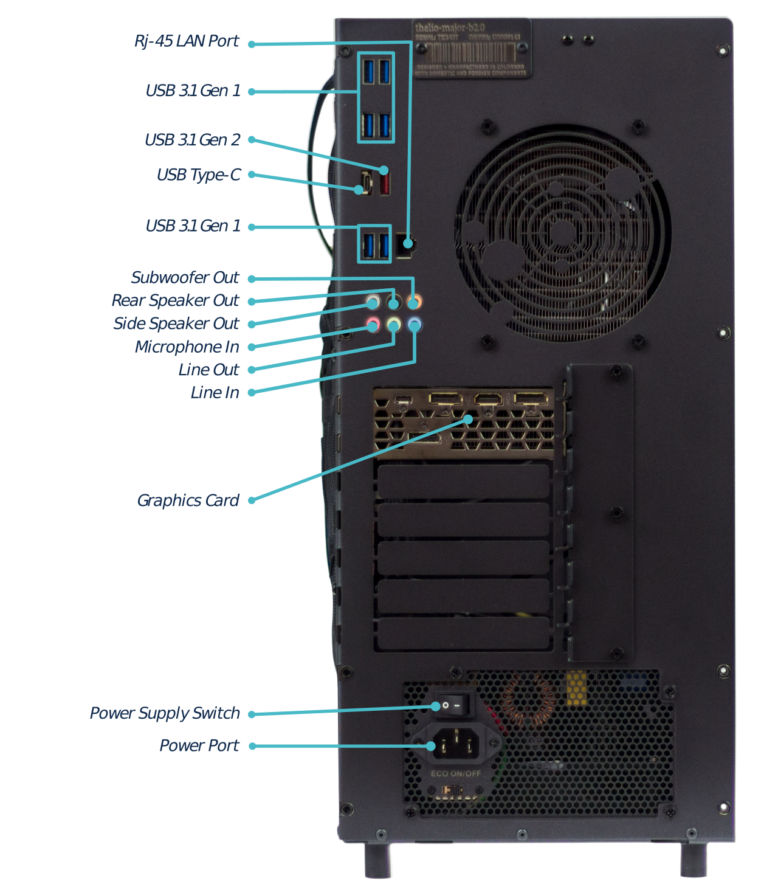
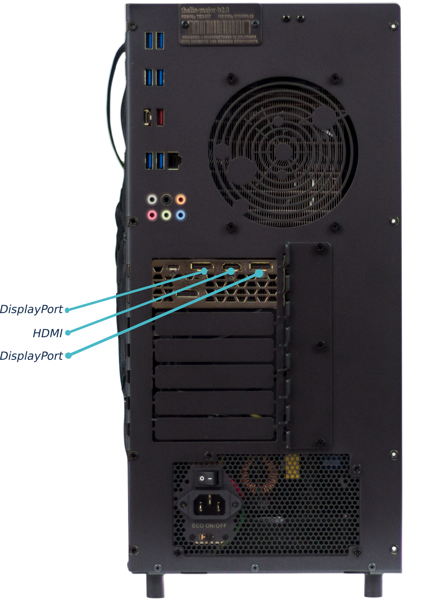

# External Overview

## Ports Overview

The Thelio MB2 has several ports accessible from the rear of the machine.

- 4 USB 3.1 Gen 1 Ports
- 4 USB 3.1 Gen 2 Ports
- 1 USB 3.1 Gen 1 Type-C
- 1 Ethernet (1Gb)
- Audio In/Out ports (3.44mm).
- 1 Standard 3-prong AC wall adapter port connected to the power supply (with power switch).

As well as an additional expansion port available via the PCI slot on the board.

**Fig. 1:** External Thelio Ports Overview.

# Connecting Displays

**Fig. 2:** Thelio external display ports overview.

Ports will differ from the above image, depending on which graphics cards you have installed.

Since neither Threadripper or Intel Core X processors have integrated graphics, a discrete graphics card is required to use displays on your Thelio Major.
