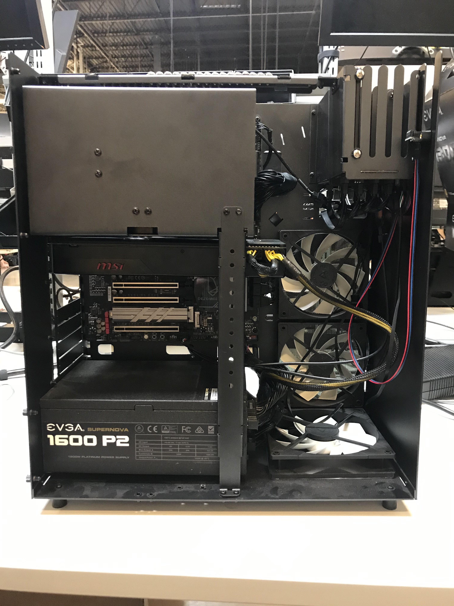
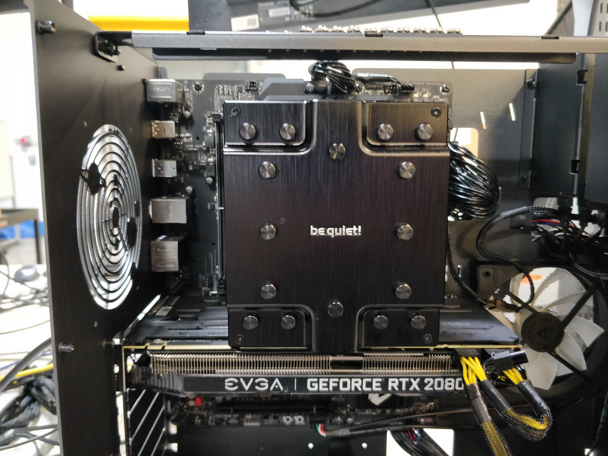
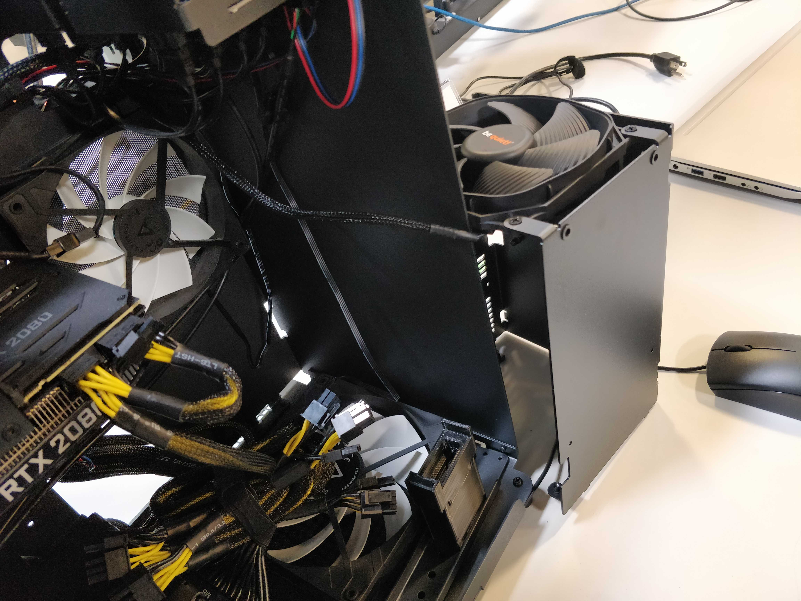
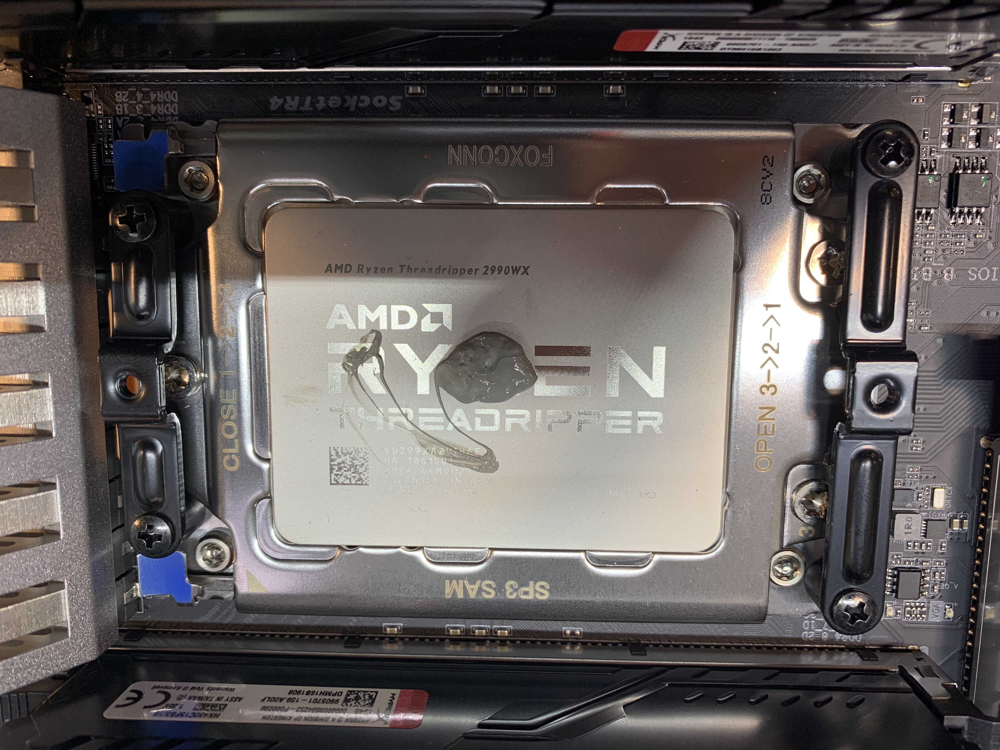

# Table of Contents
## Thelio Major B2 BIOS Overview
### [BIOS](#bios)
- [M.I.T.](#mit)
- [System](#system)
- [BIOS Menu](#biosmenu)
- [Peripherals](#peripherals)
- [Chipset](#chipset)
- [Power](#power)
- [Save and Exit](#save-and-exit)

## User Serviceable Parts and Repairs
### Top Case (Remove or Replace)
- [Removing the Top Case](#removing-the-top-case)
- [Replacing the Top Case](#replacing-the-top-case)
### Power Button (Remove or Replace)
- [Removing the Power Button](#removing-the-power-button)
- [Replacing the Power Button](#replacing-the-power-buttom)

<!--### IO Board (Remove or Replace)
- [Removing the IO Board](#removing-the-io-board)
- [Replacing the IO Board](#replacing-the-io-board)
### Case Fan (Remove or Replace)
- [Removing the Case Fan](#removing-the-case-fan)
- [Replacing the Case Fan](#replacing-the-case-fan)-->

### CPU Cooler Shroud (Remove or Replace)
- [Removing the CPU Cooler Shroud](#removing-the-cpu-cooler-shroud)
- [Replacing the CPU Cooler Shroud](#replacing-the-cpu-cooler-shroud)
### RAM (Remove or Replace)
- [Removing the RAM](#removing-ram-sticks)
- [Replacing the RAM](#replacing-ram-sticks)
### GPU (Remove or Replace)
- [Removing the GPU](#removing-the-gpu)
- [Replacing the GPU](#replacing-the-gpu)
### Drives (Remove or Replace)
- [Replacing a 2.5 Drive](#replacing-a-25-drive)
- [Replacing an M.2/NVMe Drive](#replacing-an-m2-drive)
### CPU Thermal Paste (Remove or Replace)
- [Remove the CPU Thermal Paste](#remove-the-cpu-thermal-paste)

# BIOS
Thelio systems ship with the BIOS configured to the preferred settings. For example, OSes are installed on Thelio systems in UEFI mode by default. It is not necessary to change any of these BIOS settings, however the BIOS menus are shown here for reference.

## Hardware Keyboard Shortcuts:

F12 : Boot Menu

F9  : System Information

ESC : BIOS

END : Q-Flash

## M.I.T

**Fig. 1:** The M.I.T. page allows tweaking the frequency of some system components.

## System

**Fig. 2:** System summary in BIOS.

## BIOS Menu

**Fig. 3:** BIOS boot summary.

## Peripherals

**Fig. 4:** BIOS section for Peripheral setup.

## Chipset

**Fig. 5:** Chipset information in Thelio BIOS.

## Power

**Fig. 6:** Power Management settings.

## Save and Exit

**Fig. 7:** Exit the BIOS saving changes to settings.

[Return to Contents](#table-of-contents)

# Top Case (Remove or replace)

## Removing the Top Case
Before servicing your Thelio, be sure to power off and unplug all cords from the computer.

You can find video instructions on this process [here.](https://youtu.be/Ku91wRHFGY8)

Link for the video for Top Case Service:
(https://youtu.be/Ku91wRHFGY8)

**Tools required:** Fingers or Cross-head (Phillips) screwdriver

**Time estimate:** 2 minutes

**Difficulty:** Easy

**Screws:** 8 total
  - 8 Thumbscrews (Phillips/Cross-head).

**Note:** These thumbscrews will be on the top left and right, middle left and right, and bottom left and right of the back of the case.

Do not unscrew any screws in the center of the panel. Those screws correspond with parts inside; removing them will not assist you in removing the lid.

All of Thelio’s thumbscrews are the same size, and are interchangeable.

<!--[Thelio Outer Case views](../../pictures/thelio/thelio-b1/)

PHOTOS NEED ADDED WITH SCREWS HIGHLIGHTED

**Fig. 9:** Thelio Outer Case views, front (left), back (middle), Top Case partial removal (right).-->

<!--locations of photos and/or description may change.-->

1. Unscrew the eight (8) thumbscrews from the back of the Thelio.
2. Lift the lid up and off of the chassis.

**Fig. 10:** Thelio internals with Top Case completely removed.

[Return to Contents](#table-of-contents)

## Replacing the Top Case
This guide explains how to replace the Thelio’s Top Case after performing maintenance.

**Tools required**: Fingers or Crosshead (Phillips) screwdriver

**Time estimate**: 2 minutes

**Difficulty:** Easy

**Screws:** 8 total
 - 8 Thumbscrews (Phillips/Crosshead).

1. Align the grooves inside the case with the front of the Thelio frame (the side where the power-button is located).
2. Once aligned, the case should easily slide down over the chassis.
3. Press down on the Top Case to make sure it is firmly seated, and the power button is connected internally. There should be no space between the bottom of the Top Case and the Thelio frame.
4. To ensure the case is seated correctly, plug the Thelio back into power, turn on the power-supply switch, and examine the front of the unit: the power button LED should light up if you press it, and the system fans should spin to life.

**Fig. 11:** Aligning the Thelio Top Case for replacment. A Thelio (non-major) is pictured here, but the alignment process is the same.

<!--STRAIGHTEN ALIGNMENT PHOTO AND HIGHLIGHT ALIGNMENT DETAILS-->

<!-- (left, top and bottom). Detailed view of Thelio internal switch (right, top and bottom).-->

<!--locations of photos and/or description may change.-->

[Return to Contents](#table-of-contents)

# Power Button (Remove or Replace)
If you’ve purchased a new top case for your Thelio (or received one for a support case), you may need to move the power button from your old top case to the new one. Conversely, if you’ve received a replacement power button, you may need to remove the old power button from your top case and install the new one.

## Removing the Power Button
The power button assembly is held on by a single nut inside the case.

**Tools required:** Needle-nose pliers.

**Time estimate:** 5 minutes

**Difficulty:** Easy

1. Follow the steps to [remove the top case](#removing-the-top-case)
2. Unplug the power button’s wire from the 90-degree connector (Fig. 12).
3. Next, unscrew the nut from the power button. Use a pair of needle-nose pliers to loosen the nut (Fig. 14).
4. Once the nut has been loosened, use your fingers to remove it the rest of the way (Fig. 15).
5. With the wire unplugged and the nut removed, the power button can be pushed out the front of the case (Fig. 17).
6. The black plastic rectangle inside of the case will also be loose at this point, and can be removed.

**Fig. 12:** Unplugging power button from 90-degree connector.

**Fig. 13:** Cable disconnected from 90-degree connector.

**Fig. 14:** Needle-nose pliers can help with unscrewing the nut.

**Fig. 15:** Once loose, the nut can be unscrewed with fingers.

**Fig. 16:** Removing the nut.

**Fig. 17:** Once the nut is removed, push the power button through the hole in the Top Case.

**Fig. 18:** Power being pulled completely through Top Case.

[Return to Contents](#table-of-contents)

## Replacing the Power Button

**Tools required:** Needle-nose pliers.

**Time estimate:** 5 minutes

**Difficulty:** Easy

1. Line up the black plastic rectangle with the hole inside of the case (Fig. 20).
2. While holding the black plastic rectangle to the hole, feed the power button wire through the hole and push the power button into the case (Fig. 21).
3. While holding the button in from the front, thread the power button wire through the nut, then screw the nut onto the power button (Fig. 24).
4. Tighten the nut with a pair of needle-nose pliers to ensure the plastic bracket doesn’t move around later (Fig. 26).
5. Finally, plug the power button’s wire into the 90-degree connector so the red wire is on the left (Fig. 27).
6. Follow the steps to [replace the top case](#replacing-the-top-case)

**Fig. 19:** The empty power button hole in the Top Case.

**Fig. 20:** Aligning the internal bracket.

**Fig. 21:** Inserting power button cables.

**Fig. 22:** Inserting power button through Top Case.

**Fig. 23:** Power button fully inserted in the Top Case.

**Fig. 24:** Inserting cables through nut.

**Fig. 25:** Finger tightening the nut.

**Fig. 26:** Tightening the nut with needle-nose pliers

**Fig. 27:** Connecting the 90-degree connector.

**Fig. 28:** The completed power button assembly.

[Return to Contents](#table-of-contents)

<!-- This will be for v2.0

# IO Board (Remove or Replace)

## Removing the IO Board

**Tools required:**

**Time estimate:**

**Difficulty:** Medium

## Replacing the IO Board

**Tools required:**

**Time estimate:**

**Difficulty:** Medium

[Return to Contents](#table-of-contents)

# Case Fan (Remove or Replace)

## Removing the Case Fan

## Replacing the Case Fan

[Return to Contents](#table-of-contents)
-->

# CPU Cooler Shroud (Remove or replace)

## Removing the CPU Cooler Shroud

**Tools required:** Cross-head (Phillips) screwdriver

**Time estimate:** 2 minutes

**Difficulty:** Easy

**Screws:** 16 total
  - 8 Thumbscrews (Phillips/Cross-head) Top Case.
  - 4 Thumbscrews (Phillips/Cross-head) Shroud.
  - 4 Non-Thumbscrews (Phillips/Cross-head) Shroud Bracket.

  <!--This section especially needs checked for accuracy.-->
1. Follow the steps in [Removing the Top Case](#removing-the-top-case)
2. Next unfasten the Shroud. To do this, unscrew the 4 thumbscrews near the top of your chassis. They frame the planet themed air-vent (see fig 18 above).
3. Unscrew the four (4) support bracket screws holding up the cooler shroud. There are two (2) Cross-head (Phillips) screws at the bottom of the chassis, and two (2) on the side of the shroud.
4. Set the bracket and screws safely aside.
5. Slide the Cooler Shroud horizontally off of the CPU Cooling fan, and set aside.
6. You are now free to perform work on the CPU Cooler fan, or access other components that may have been obstructed by the shroud.

  

**Fig. 29:** the 4 CPU Cooler Shroud thumbscrews.

  

**Fig. 30:** Top two Phillips screws of the Cooler bracket.

  

**Fig. 31:** Bottom two Phillips screws of the Cooler bracket.

  

**Fig. 32:** Showing the direction to remove the Cooler Shroud.

  

**Fig. 33:** Exposed Cooler Shroud.

  

**Fig. 34:** Removed Cooler Shroud for reference.

  

**Fig. 35:** Removed CPU Cooler Shroud and attached fan beside Thelio Chassis.

[Return to Contents](#table-of-contents)

## Replacing the CPU Cooler Shroud

**Tools required:** Fingers or Cross-head (Phillips) screwdriver

**Time estimate:** 2 minutes

**Difficulty:** Easy

**Screws:** 16 total
  - 8 Thumbscrews (Phillips/Cross-head) Top Case.
  - 4 Thumbscrews (Phillips/Cross-head) Shroud.
  - 4 Non-Thumbscrews (Phillips/Cross-head) Shroud Bracket.

1. Slide the Cooler Shroud horizontally over the CPU
cooling fan, encasing it.
2. Align the holes of the Shroud with the holes framing
the air-vent on the back of the chassis.
3. Replace the four thumbscrews on the back of the case,
fastening the shroud to the outer frame.
4. Replace the four (4) support bracket screws holding up
the cooler shroud. There are two (2) Cross-head (Phillips)
screws at the bottom of the chassis, and two (2) on the
side of the shroud.
5. Follow the steps in [Replacing the Top Case.](#replacing-the-top-case)

  <!--Hyperlink to Replacing Top Case section needed.-->

  

Fig. 36: The exposed cooler.

  

Fig. 37: Direction for replacing the Shroud.

  

Fig. 38: Top two Phillips screws of the Cooler bracket replaced.

  

Fig. 39: Bottom two Phillips screws of the Cooler bracket.

  

**Fig. 40:** Replacing the CPU Cooler Shroud thumbscrews.

[Return to Contents](#table-of-contents)

# RAM (Remove or Replace)

The motherboard in the Thelio Majors require specific placement of the RAM sticks in order for the RAM modules to be utilized properly and for the system to boot.

You can use the following tables to determine the placement of your RAM modules by number used.

## Thelio Major B2

| Modules Used  | DDR4_1_1B    | DDR4_3_2B     | DDR4_2_1A     | DDR4_4_2A     | CPU  | DDR4_4_2C    | DDR4_2_1C     | DDR4_3_2D     | DDR4_1_1D     |
|---------------|:------------:|:-------------:|:-------------:|:-------------:|:----:|:------------:|:-------------:|:-------------:|:-------------:|
| **2 Modules** | **X**        | **X**         | **X**         | **X**         |      | **X**        |               | **X**         |               |

| Modules Used  | DDR4_1_1B    | DDR4_3_2B     | DDR4_2_1A     | DDR4_4_2A     | CPU  | DDR4_4_2C    | DDR4_2_1C     | DDR4_3_2D     | DDR4_1_1D     |
|---------------|:------------:|:-------------:|:-------------:|:-------------:|:----:|:------------:|:-------------:|:-------------:|:-------------:|
| **4 Modules** |              | **X**         |               | **X**         |      | **X**        |               | **X**         |               |

| Modules Used  | DDR4_1_1B    | DDR4_3_2B     | DDR4_2_1A     | DDR4_4_2A     | CPU  | DDR4_4_2C    | DDR4_2_1C     | DDR4_3_2D     | DDR4_1_1D     |
|---------------|:------------:|:-------------:|:-------------:|:-------------:|:----:|:------------:|:-------------:|:-------------:|:-------------:|
| **6 Modules** |              | **X**         |               | **X**         |      |              |               |               |               |

| Modules Used  | DDR4_1_1B    | DDR4_3_2B     | DDR4_2_1A     | DDR4_4_2A     | CPU  | DDR4_4_2C    | DDR4_2_1C     | DDR4_3_2D     | DDR4_1_1D     |
|---------------|:------------:|:-------------:|:-------------:|:-------------:|:----:|:------------:|:-------------:|:-------------:|:-------------:|
| **8 Modules** |              |               |               |               |      |

## Thelio Major R1

| Modules Used  | DDR4_D2      | DDR4_D1       | DDR4_C2       | DDR4_C1       | CPU  |  DDR4_A1      | DDR4_A2       | DDR4_B1       | DDR4_B2       |
|---------------|:------------:|:-------------:|:-------------:|:-------------:|:----:|:-------------:|:-------------:|:-------------:|:-------------:|
| **1 Modules** | **X**        | **X**         | **X**         | **X**         |      | **X**         |               | **X**         | **X**         |

| Modules Used  | DDR4_D2      | DDR4_D1       | DDR4_C2       | DDR4_C1       | CPU  |  DDR4_A1      | DDR4_A2       | DDR4_B1       | DDR4_B2       |
|---------------|:------------:|:-------------:|:-------------:|:-------------:|:----:|:-------------:|:-------------:|:-------------:|:-------------:|
| **2 Modules** | **X**        | **X**         | **X**         | **X**         |      |  **X**        |               | **X**         |               |

| Modules Used  | DDR4_D2      | DDR4_D1       | DDR4_C2       | DDR4_C1       | CPU  |  DDR4_A1      | DDR4_A2       | DDR4_B1       | DDR4_B2       |
|---------------|:------------:|:-------------:|:-------------:|:-------------:|:----:|:-------------:|:-------------:|:-------------:|:-------------:|
| **4 Modules** |              | **X**         |               | **X**         |      |  **X**        |               | **X**         |               |

| Modules Used  | DDR4_D2      | DDR4_D1       | DDR4_C2       | DDR4_C1       | CPU  |  DDR4_A1      | DDR4_A2       | DDR4_B1       | DDR4_B2       |
|---------------|:------------:|:-------------:|:-------------:|:-------------:|:----:|:-------------:|:-------------:|:-------------:|:-------------:|
| **6 Modules** |              |               |               | **X**         |      |  **X**        |               |               |               |

| Modules Used  | DDR4_D2      | DDR4_D1       | DDR4_C2       | DDR4_C1       | CPU  |  DDR4_A1      | DDR4_A2       | DDR4_B1       | DDR4_B2       |
|---------------|:------------:|:-------------:|:-------------:|:-------------:|:----:|:-------------:|:-------------:|:-------------:|:-------------:|
| **8 Modules** |              |               |               |               |      |               |               |               |               |

## Removing RAM Sticks

You can find video instructions on this process [here.](https://youtu.be/OFv8ByuDGU0)

Link for the video for RAM Service:
(https://youtu.be/OFv8ByuDGU0)

**Tools required:** Fingers or Crosshead (Phillips) screwdriver (for Top Case)

**Time estimate:** 5 minutes

**Difficulty:** Easy

**Screws:** 12 total
  - 12 Thumbscrews (Phillips/Crosshead).

  1. Follow the steps in [Removing the Top Case.](#removing-the-top-case)
  2. It may be helpful, but is not necessary, to [Remove the CPU Cooler Shroud.](#removing-the-shroud)
  <!--it may be necessary on this model.-->
  3. Press simultaneously on each clip on either side of the RAM stick (fig 21 above). These clips will release the RAM stick and lever it out of it’s slot on the board.
  4. Gently, but firmly pull the RAM straight out of the slot, and set aside.

  

**Fig.41:** Accessing the RAM release clips.

  

**Fig. 42:** Placement of the RAM notch on the motherboard.

  

**Fig. 43:**  Placement of the RAM notch on the RAM stick.

[Return to Contents](#table-of-contents)

## Replacing RAM Sticks

**Tools required:** Fingers or Crosshead (Phillips) screwdriver (for Top Case)

**Time estimate:** 5 minutes

**Difficulty:** Easy

**Screws:** 12 total
  - 12 Thumbscrews (Phillips/Crosshead).

  1. Line up the notch on the stick with the notch in the slot. One side of the RAM stick has fewer pins and is shorter. This will help you orient the stick.
  2. Insert the RAM stick in the slot. The order of the slots matters, (see tables above).
  3. Press evenly on the memory stick until both tabs lock into place. You’ll hear two clicks once it’s seated, and the clips will snap closed against the RAM.
  4. Once the RAM is in place, [replace the CPU Cooler Shroud](#replacing-the-cpu-cooler-shroud) (if applicable).
  5. [Replace the Top Case.](#replacing-the-top-case)
  6. Reconnect external devices: keyboard, mouse, monitor(s).
  7. Reconnect external power cable and turn power-supply switch to the on position.
  8. Power the Thelio on to ensure the RAM is working correctly. If so, the computer will boot normally.

  

**Fig. 44:** Indicating the RAM notch on the motherboard.

  

**Fig. 45** Indicating the RAM notch on the RAM stick.

  

**Fig. 46** Pressing the RAM stick down into place.

[Return to Contents](#table-of-contents)

# GPU (Remove or replace)

## Removing the GPU

In this guide, you will learn how to remove the graphics card on your Thelio. These steps must be taken in order to replace the GPU.
You can find video instructions on this process [here.](https://youtu.be/3bUcp0S1HrE)

Link for the video for GPU removal:
(https://youtu.be/3bUcp0S1HrE)

For this procedure, a Cross-head (Phillips) screwdriver may be helpful, as well as a wooden or plastic (non-conductive) tool for reaching between components. A pencil, ruler, chopsticks or a plastic computer repair tool will work well. **Do not use anything made of metal.**

**Tools required:** Fingers or Cross-head (Phillips) screwdriver, a tool for pressing the GPU release bracket (non-conductive).

**Time estimate:** 10 minutes.

**Difficulty:** Medium

**Screws:** 19 total
  - 19 Thumbscrews (Phillips/Cross-head).

**Before you remove the lid, be sure to power off and unplug all cords from the computer.**

1. First follow the steps in [Removing the Top Case.](#removing-the-top-case)
2. It may also be helpful to [Remove the CPU Cooler Shroud.](#removing-the-shroud)
3. To remove your graphics card, twist off the 3 thumbscrews from the PCI bracket.
4. Remove the GPU brace. Unscrew the bottom two screws, and then the top two screws, to remove the brace. Both the PCI bracket and the GPU brace keep your graphics card secure and in place (Fig 23).
5. Remove the GPU from the PCIe slot by pressing on the release clip on the right. This is where your chosen (non-metal) poking tool may come in handy, to reach the clip on the board without trying to squeeze your hand between components.
6. Disconnect the power cables from the GPU (if applicable), and tie back any cables you are not planning on using with the provided velcro straps.
7. Now you are ready to install an alternative or [replacement GPU.](#replacing-the-gpu)
8. If you are not planning on installing another GPU follow the steps to [Replace the CPU Cooler Shroud,](#replacing-the-shroud) [Replace the Top Case,](#replacing-top-case) and reconnect all cables and peripherals.

<!--[Removing the thumbscrews and GPU Bracket](../../pictures/thelio/thelio-b1/)

**Fig. 23:** Removing the thumbscrews and GPU Bracket.-->

caption

**Fig. 47:** Close view of the GPU leaving the PCIe slot (top) and the PCIe release switch (bottom).

<!--[Removal of the GPU external view](../../pictures/thelio/thelio-b1/)-->

<!--**Fig. 25:** Removal of the GPU external view.-->

[Return to Contents](#table-of-contents)

## Replacing the GPU

For this procedure, a Cross-head (Phillips) screwdriver may be helpful, as well as a wooden or plastic (non-conductive) tool for reaching between components. A pencil, ruler, chopsticks or a plastic computer repair tool will work well. **Do not use anything made of metal.**

**Tools required:** Fingers or Crosshead (Phillips) screwdriver, a tool for pressing the GPU release bracket (non-conductive).

**Time estimate:** 10 minutes.

**Difficulty:** Medium

**Screws:** 19 total
  - 19 Thumbscrews (Phillips/Crosshead).

  If you have not yet completed the steps to remove the PCI bracket and GPU brace, you will find these instructions in the section on [Removing the GPU](#removing-the-gpu)

  **Fig. 28:** Replacing the thumbscrews and GPU Bracket.-->
  **NOTE: Some GPU's use the PCI-e slot for power and don't need a cable. If your Thelio is configured with a Radeon RX 550 graphics card, for example, you will not find any power connector slots on your GPU. The cards compatible with this Thelio model require 8-pin, 12 pin or 16-pin power cable connections.**

  

  **Fig: 48** Showing variations of pin connections on GPU cards - 16-pin (left), 12-pin (middle), 8-pin (right).

**Fig. 49:** Thelio internal context view of PCIe slot.

**Fig. 50:** Close up view of the PCIe slots.

<!--[PICTURES NEEDED]-->

<!--[Replacing the thumbscrews and GPU Bracket](../../pictures/thelio/thelio-b1/)-->

1. After [removing the GPU](#removing-the-gpu) (Or, if no GPU is installed, removing the bracket, insert the new graphics card into the PCIe slot until it clicks into place.
2. Once the GPU is securely in place, attach the internal and external brackets.
3. Securely fasten the brackets in place with the provided thumbscrews.
4. Prepare the necessary power connectors for your graphics card. You can tell which wires you’ll need by looking at the ports on the front of your GPU. The necessary cabling is provided inside your Thelio’s chassis.
5. Do not connect the cables to the GPU until it has been inserted in the PCIe slot and secured with the brackets.
6. Connect the power cables to the GPU selecting the cables based on the number of pins (See NOTE below).
7. Wrap up any unused wires with the velcro strap and store those wires back in the chassis so that they’re not blocking the fan.
8. Once the GPU is connected and the power cables secured (fig #), replace the Top Case, reconnect external power cable.
9. Turn the power supply switch at the rear of the machine to the “on” position.

[IMAGE OF GPU CABLING]
**Fig. 51**

[Return to Contents](#table-of-contents)

# Drives (Remove or Replace)

In this guide, you will learn how to remove or replace drives in your Thelio.
You can find video instructions on this process [here.](https://youtu.be/6fIeVEaY7dE)

Link for the video for Drive Service removal:
(https://youtu.be/6fIeVEaY7dE)

## 2.5" SATA Drives

The Thelio Major B2 provides eight (8) slots for 2.5” SATA drives. They are housed in the Thelio Drive Cage for easy access. Each drive is connected to a SATA port on the Thelio IO board, which acts as a conduit, connecting the drives to the motherboard.

## M.2 Drives
The number and location of M.2 drives, differs between the Thelio Major R and B models.

  **Fig. 52:** Thelio Major (thelio-major-r2) front M.2 drive slots (left).
  **Fig. 53:** Thelio Major (thelio-major-b2) front M.2 drive slots (right)

### Thelio Major R2

The Thelio Major R2 has three (3) M.2 drive slots. One on the board, above the PCIe slot which holds the GPU, one below the right-side RAM slots, and one to the right of the lower 3 PCIe slots (**Fig. 52**).

### Thelio Major B2

The Thelio Major B2 has one two (2) M.2 Drive slots. One on above the top PCIe slot, and one below the top PCIe slot (**Fig. 53**).

Depending on the M.2 drive slot you intend to use, remove the CPU Cooler Shroud and/or GPU to gain easier access. You can find video instructions on this process [here.](https://youtu.be/3bUcp0S1HrE)

Link for the video for GPU removal:
(https://youtu.be/3bUcp0S1HrE)

## Replacing a 2.5 Drive

**Tools required:** Fingers or Crosshead (Phillips) screwdriver, a tool for pressing the GPU release bracket (non-conductive).

**Time estimate:** 10 minutes.

**Difficulty:** Easy

**Screws:** 12 total
  - 8 Thumbscrews (Phillips/Crosshead) in the Top Case.
  - 4 Thumbscrews (Phillips/Crosshead) per Drive.

**Before you remove the lid, be sure to power off and unplug all cords from the computer.**

To remove the drive, gently pull on the drive and slide it out from the drive cage.

[Return to Contents](#table-of-contents)

## Installing a 2.5 Drive

**Tools required:** Fingers or Crosshead (Phillips) screwdriver, a tool for pressing the GPU release bracket (non-conductive).

**Time estimate:** 10 minutes.

**Difficulty:** Easy

**Screws:** 12 total
  - 8 Thumbscrews (Phillips/Crosshead) in the Top Case.
  - 4 Thumbscrews (Phillips/Crosshead) per Drive.

To add a 2.5-inch drive, you’ll need 4 screws to secure the drive in place. Extra screws are provided on the chassis for convenience.

1. Follow the steps to [Remove the Top Case.](#removing-the-top-case)
2. You may want to remove the washer out of the provided bar-bracket. Do so by pushing up from underneath the bracket until the washer pops out.
3. Next, slide each screw along the bar-bracket to the opening and remove the screw.
4. Screw these four thumbscrews into the holes at the corners of the drive to keep it securely fastened in the drive cage.
5. Before inserting the drive into the drive cage, line up the connectors on the drive with the connectors in the drive cage.
6. Then, line up the inside of the grommet with the prongs on the drive cage, and insert the drive until it locks into place.
7. [Replace the Top Case](#replacing-the-top-case) and reconnect all cables.

**Fig.54:** Thelio Top Bracket with provided drive screws.

**Fig. 55:** Aligning the drive screws and grommets with drive cage slots.

**Fig. 56:** Inserting the drive in to the cage slot.

**Fig. 57:** Drive inserted almost fully in the slot.

**Fig: 58** Pressing the drive firmly into place.

[Return to Contents](#table-of-contents)

## Removing an M.2 Drive

Removing an M.2 may require removal of the GPU or CPU Cooler Shroud for easier access. A Crosshead (Phillips) screwdriver is required.

**Tools required:** Fingers or Crosshead (Phillips) screwdriver, a tool for pressing the GPU release bracket (non-conductive).

**Time estimate:** 5-10 minutes.

**Difficulty:** Easy

**Screws:** 9 total
  - 8 Thumbscrews (Phillips/Crosshead) in the Top Case.
  - 1 M.2 securing screw (per Drive).

1. Follow the steps to [Remove the Top Case.](#removing-the-top-case)
2. [Remove the CPU Cooler Shroud](#removing-the-shroud) (if applicable).
3. [Remove the GPU](#removing-the-gpu) (if applicable).
4. Unscrew the M.2 screw opposite the M.2 slot. Set it safely aside.
5. Gently, but firmly remove the M.2 drive horizontally from the slot.
6. Replace the screw, fastening the M.2 in place.
7. [Replace the GPU](#replacing-the-gpu) (if applicable).
8. [Replace the CPU Cooler Shroud](#replacing-the-shroud) (if applicable).
9. [Replace the Top Case.](#replacing-the-top-case)
10. Reconnect all cables and peripherals.

[Return to Contents](#table-of-contents)

## Replacing an M.2 Drive

Replacing an M.2 drive may require removal of the GPU or CPU Cooler Shroud for easier access. A Crosshead (Phillips) screwdriver is required.

**Tools required:** Fingers or Crosshead (Phillips) screwdriver, a tool for pressing the GPU release bracket (non-conductive).

**Time estimate:** 5-10 minutes.

**Difficulty:** Easy

**Screws:** 13 total
  - 12 Thumbscrews (Phillips/Crosshead) in the Top Case.
  - 1 M.2 securing screw (per Drive).

1. Follow the steps to [Remove the Top Case.](#removing-the-top-case)
2. [Remove the CPU Cooler Shroud](#removing-the-shroud) (if applicable).
3. [Remove the GPU](#removing-the-gpu) (if applicable).
4. Unscrew the M.2 screw opposite the M.2 slot. Set it safely aside.
5. Line up the notch on the M.2 drive.
6. Insert the new drive into its port on the motherboard.
7. Replace the screw, fastening the M.2 in place.
8. [Replace the GPU](#replacing-the-gpu) (if applicable).
9. [Replace the CPU](replacing-the-cooler) Cooler Shroud (if applicable).
10. [Replace the Top Case.](#replacing-the-top-case)
11. Reconnect all cables and peripherals.

**NOTE:** By default, the first of the two M.2 drives (NVMe or not) stores your operating system, so you will need to reinstall the OS after replacing it. This can be done by restoring from a backup, or from a fresh install.

Pop!\_OS users, instructions to reinstall the OS can be found here: https://support.system76.com/articles/install-pop/

Ubuntu users, instructions to reinstall the OS can be found here: https://support.system76.com/articles/install-ubuntu/.

[Return to Contents](#table-of-contents)

# CPU Thermal Paste (Remove or Replace)

If you are experiencing thermal issues with your Thelio, one possible solution is to change the Thermal paste. Thermal paste helps transfer heat from the CPU to the CPU Cooler via the heat sink.

Thermal paste can lose its effectiveness over time and may need to be re-applied.

This guide will explain how to remove the CPU Cooler, clean the CPU of thermal paste, and reapply a new coat.

**WARNING: DO NOT use your Thelio without thermal paste.** Running the machine without Thermal Paste could result in overheating, system shutdowns and possibly damage to the internal components.

## Remove the CPU Thermal Paste

Removing CPU thermal paste requires removal of the CPU Cooler Shroud. It may also require removing the GPU for easier access.

**Tools required:** Crosshead (Phillips) screwdriver, Rubbing Alcohol, Paper Towels, Thermal Paste.

**Time estimate:** 15-20 mins.

**Difficulty:** Hard

**Screws:** 16 total
  - 8 Thumbscrews (Phillips/Crosshead) on the Top Case.
  - 4 Thumbscrews (Phillips/Crosshead) on the CPU Cooler Shroud.
  - 4 Bracket Screws securing the CPU heat sink.

<!-- all of these screw numbers will need verified-->

1. Follow the steps in [Removing the Top Case.](#removing-the-top-case)
2. Follow the steps in [Removing the CPU Cooler Shroud.](#removing-the-shroud)
3. Follow the steps in [Removing the GPU](#removing-the-gpu) (if applicable).
4. Gently but firmly separate the Cooling Fans from the Heat Sink. The fans are held on by clips which can be pried from the sides of the heat sink.
5. Next, disconnect the power cables from the Cooling Fans.
6. Remove the four (4) bracket screws fastening the Heat Sink to the board. Loosen the screws one at a time. Move from opposite corner to opposite corner, diagonally across the Heat Sink. For example: first, top left screw, then bottom right screw (fig. 34). This ensures even pressure between the brackets and the motherboard.
7. Lift the Heat Sink off of the motherboard.
8. You’ll notice that there is Thermal Paste coating the bottom of the Heat Sink as well as the CPU core.
9. Apply Rubbing Alcohol to a sheet of Paper Towel and wipe the Thermal Paste off of the bottom of the Heat Sink and CPU core until they are totally clean.
10. If you are replacing the Thermal Paste, continue on to the section Replacing the CPU Thermal Paste (See Important NOTE below).
11. Replace the Heat Sink over the CPU core.
12. Re-fasten the Heat Sink screws, again using the opposite corner method described above.
13. Follow the steps to [Replace the GPU](#replacing-the-gpu) (if applicable).
14. Follow the steps to [Replace the CPU Cooler Shroud.](#replacing-the-shroud)
15. Follow the steps to [Replace the Top Case.](#replacing-the-top-case)

<!--[PICTURES NEEDED]-->

<!--[Removing the CPU Cooler Fan from the Heat Sink](../../pictures/path-to-picture)

**Fig. 33:** Removing the CPU Cooler Fan from the Heat Sink.

**Fig. 34:** Loosening/Removing screws on opposite corners.

**Fig. 35:** Lifting the Heat Sink free (left). The bottom of the heat sink covered in old Thermal Paste.

**Fig. 36:** Cleaning old thermal paste of the bottom of the Heat Sink (left), and off the CPU core (right).-->

[Return to Contents](#table-of-contents)

## Replace the CPU Thermal paste

Replacing CPU thermal requires removal of the CPU Cooler Shroud. It may also require removing the GPU for easier access.

**Tools required:** Crosshead (Phillips) screwdriver, Thermal Paste.

**Time estimate:** 15-20 mins.

**Difficulty:** Easy

**Screws:** 12 total
  - 8 Thumbscrews (Phillips/Crosshead) on the Top Case.
  - 4 Thumbscrews (Phillips/Crosshead) on the CPU Cooler Shroud.
  - 4 Bracket Screws securing the CPU heat sink.

1. Follow steps 1-9 in [Removing the CPU Thermal Paste.](#removing-cpu-thermal-paste)
2. Once the Heat Sink and CPU core are free of old Thermal Paste, apply new paste in a line down the middle of the CPU core (fig. 37).
3. Once the paste is applied, replace the Heat Sink over top of it. The Heat Sink will spread the thermal paste across the CPU core, there is no need to spread it yourself.
4. Re-fasten the four (4) screws on the Heat Sink. In fastening the screws, partially tighten them one at a time, and move diagonally to the opposite corner. For example, tighten the top-left screw halfway, then move to the bottom right, and tighten that halfway. Repeat until all screws are tight. This ensures even pressure between the brackets and the motherboard.
5. Once the Heat Sink is fastened down, clip the CPU Cooling Fans back onto the Heat Sink.
6. Reconnect the power cables to the CPU Cooling Fans.
7. Follow the steps in [Replacing the GPU](#replacing-the-gpu) (if applicable).
8. Next, follow the steps in [Replacing the CPU Cooler Shroud.](#replacing-the-shroud)
9. Follow the steps in [Replacing the Top Case.](#replacing-the-top-case)
10. Reconnect all external cables and peripherals, and turn the Power Supply switch to the “on” position.
11. Power on the Thelio to ensure successful boot.

**NOTE: The pictures shown here are the Thelio R1 (AMD) model with a Threadripper processor. However, the process and cautions when removing and replacing thermal paste are the same for both Intel and AMD Thelio Majors.**

**Fig. 59:** A cleaned CPU core.

**Fig. 60:** Reapplied thermal paste on the core.

[Return to Contents](#table-of-contents)
